# Homelab — Month 1

## Goal
Build practical IT support/sysadmin skills through hands-on labs, targeting entry-level helpdesk roles.

## Environment
- Host: MacBook M1
- Virtualization: UTM (native ARM virtualization)
- VM 1: Ubuntu Server 24.04 ARM64
- Cloud: Microsoft 365 Business Premium 30-day trial

## Plan
- Week 1: Environment setup
- Week 2: Networking fundamentals (static IP, DNS, firewall rules)
- Week 3: Cloud identity basics (Entra ID users/groups, Intune enrollment)
- Week 4: Simulated helpdesk ticketing (osTicket in Docker)

## Log

### Week 1 — Setup & Initialization

**Aug 29, 2026 — VM creation and boot loop**
- Created Ubuntu Server 24.04 LTS ARM64 VM in UTM (Virtualize mode, 2 CPU / 4GB RAM / 25GB disk).
- Hit a boot loop after install completed: VM kept booting back into the installer instead of the installed OS.
- Root cause: UTM's boot order checked the virtual CD/ISO drive before the disk, so it kept re-launching the installer on every restart.
- Fix: ejected the ISO from VM settings (Drives → CD/DVD → Clear), then rebooted — VM loaded the installed OS correctly.
- Next time: check/set boot order to disk-first *before* first boot, to skip this entirely.

**Aug 29, 2026 — Networking and SSH**
- Confirmed network adapter `enp0s1` got a DHCP-assigned IP: `192.168.64.3`.
- Installed OpenSSH server during setup; verified access from Mac host.
- Noted: IP is DHCP-assigned, so it may change on reboot — planning to set a static IP or DHCP reservation before relying on this for daily work.

**Aug 29, 2026 — Remote development setup**
- Installed the Remote-SSH extension in VS Code on the Mac host, connected to `192.168.64.3` using the SSH config below, and confirmed I can browse/edit files on the VM directly from the Mac.

**Aug 29, 2026 — M365 tenant setup**
- Signed up for Microsoft 365 Business Premium 30-day trial (chose this after 
  the free Developer Program required a qualifying subscription I didn't have).
- Admin center accessible at admin.microsoft.com — confirmed login.

**Aug 29, 2026 — Static IP configuration**
- Replaced DHCP with a static IP via netplan to stop the address from changing on reboot (was risking breaking SSH/VS Code access each time).
- Config (`/etc/netplan/*.yaml`):
```yaml
  network:
    version: 2
    ethernets:
      enp0s1:
        dhcp4: no
        addresses:
          - 192.168.64.3/24
        routes:
          - to: default
            via: 192.168.64.1
        nameservers:
          addresses:
            - 1.1.1.1
            - 8.8.8.8
```
- Applied with `sudo netplan apply`.
- Verified persistence and connectivity after reboot:
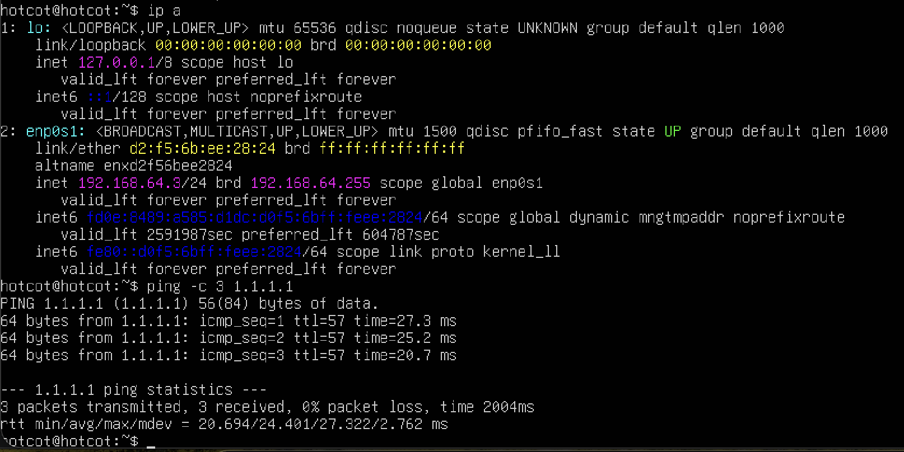

## Week 1 Summary
- Working Ubuntu Server VM with static IP and SSH access, developed remotely via VS Code.
- Live M365 Business Premium tenant ready for Entra ID/Intune work in Week 3.
- Public repo established as the running record of this project.
- One open item carried into Week 2: confirm static IP/DNS survives reboot (see verification block above).

### Week 2 — Networking Fundamentals

**Aug 30, 2026 — VM2 creation and dual-VM connectivity**
- Created VM 2: Ubuntu Server 24.04 LTS ARM64 in UTM (Virtualize mode, 2 CPU / 4GB RAM / 25GB disk), OpenSSH enabled during install.
- Confirmed both VMs are on UTM's Shared Network mode, same virtual switch — checked in UTM VM settings before assuming it, rather than after hitting a problem.
- Assigned VM2 a static IP on the same subnet as VM1 via netplan:
```yaml
  network:
    version: 2
    ethernets:
      enp0s1:
        dhcp4: no
        addresses:
          - 192.168.64.4/24
        routes:
          - to: default
            via: 192.168.64.1
        nameservers:
          addresses:
            - 1.1.1.1
```
- Applied with `sudo netplan apply`, rebooted, verified IP held.
- Verified bidirectional connectivity between the two VMs:
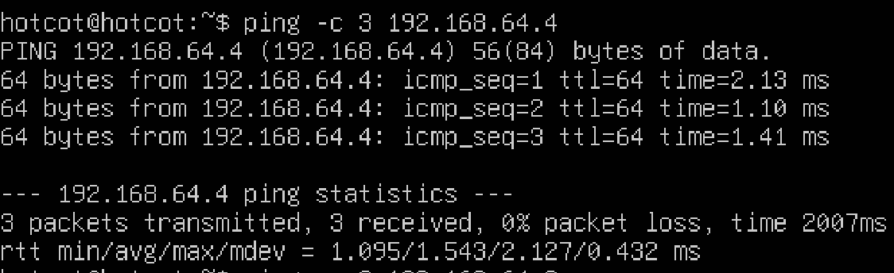
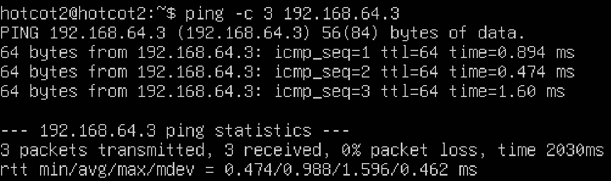
- Result: both VMs reachable in both directions on first attempt — no UTM network-mode mismatch to troubleshoot this time.
- Next: set up VM1 as a basic DNS server (dnsmasq) and point VM2 at it.

**Aug 30, 2026 — DNS server setup (VM1) and resolution issues (VM2)**

**Setup:**
- Installed dnsmasq on VM1: `sudo apt install dnsmasq -y`
- Added a custom DNS record in `/etc/dnsmasq.conf`.
- Restarted the service: `sudo systemctl restart dnsmasq`

**Issue 1 — netplan DNS config rejected on VM2**
- Error: `Failed to set DNS configuration: Link lo is loopback device`
- Cause: attempted to apply DNS settings in a way that conflicted with how 
  systemd-resolved manages the loopback interface.
- Fix: `sudo systemctl disable systemd-resolved` — removed the conflicting 
  resolver so netplan's DNS setting could take effect directly.
- Remark: On a real production machine I would edit /etc/systemd/resolved.conf to set the DNS server without fully disabling the service.

**Issue 2 — queries never reaching VM1**
- Symptom: `dig server1.lab.local` returned `status: REFUSED`, with the 
  response coming from `127.0.0.53#53` instead of `192.168.64.3`.
- Root cause: VM2 was querying Ubuntu's local stub resolver 
  (`systemd-resolved`, bound to `127.0.0.53`) instead of forwarding the 
  request to VM1 at all — the stub resolver intercepts DNS queries by 
  default and doesn't automatically relay them to a custom nameserver.
- Fix: set the resolver explicitly in `/etc/systemd/resolved.conf`:
[Resolve]
DNS=192.168.64.3

**Issue 3 — `.local` domain collision with mDNS**
- Symptom: even after fixing the resolver target, `ping server1.lab.local` 
  still failed to resolve via standard DNS.
- Root cause: `systemd-resolved` reserves the `.local` TLD specifically for 
  Multicast DNS (mDNS/Bonjour-style discovery) and intercepts any `.local` 
  query before it can be forwarded as a normal unicast DNS request — so no 
  matter how the resolver was pointed, `.local` names were being handled by 
  the wrong protocol entirely.
- Fix: renamed the DNS record to avoid the reserved TLD:
address=/server1.lab/192.168.64.3
  (updated `/etc/dnsmasq.conf` on VM1, restarted dnsmasq, and re-tested 
  from VM2 using `server1.lab` instead of `server1.lab.local`)

**Verification:**
$ dig server1.lab
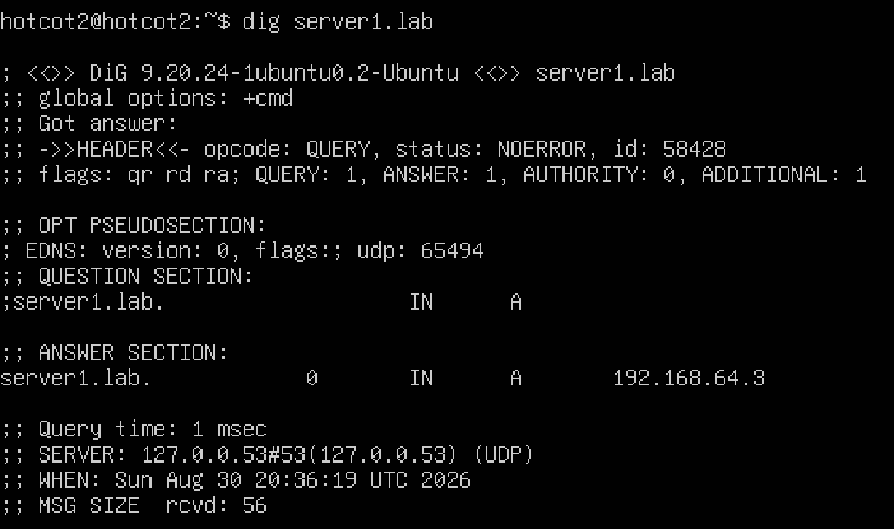
$ ping -c 3 server1.lab
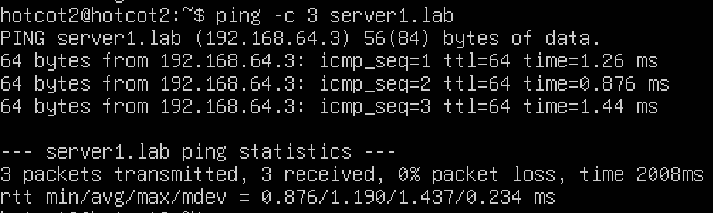

**Takeaway:** the actual DNS server config was correct from the start — 
every failure here was a client-side resolver problem (systemd-resolved 
intercepting queries and reserving `.local` for mDNS), not a dnsmasq issue. 
Worth remembering for real troubleshooting: confirm which resolver a client 
is actually using (`resolvectl status` would have shown this immediately) 
before assuming the server-side config is wrong.

**Next:** set up ufw firewall rules on VM1, then deliberately break and fix 
one to close out Week 2.

**Aug 31, 2026 — Firewall rules on VM1 (ufw)**
- Set default-deny posture and allowed only the specific traffic needed from VM2:
```bash
  sudo ufw default deny incoming
  sudo ufw allow from 192.168.64.4 to any port 22 proto tcp   # SSH from VM2 only
  sudo ufw allow from 192.168.64.4 to any port 53              # DNS from VM2 only
  sudo ufw enable
```
- Confirmed rules applied as expected:
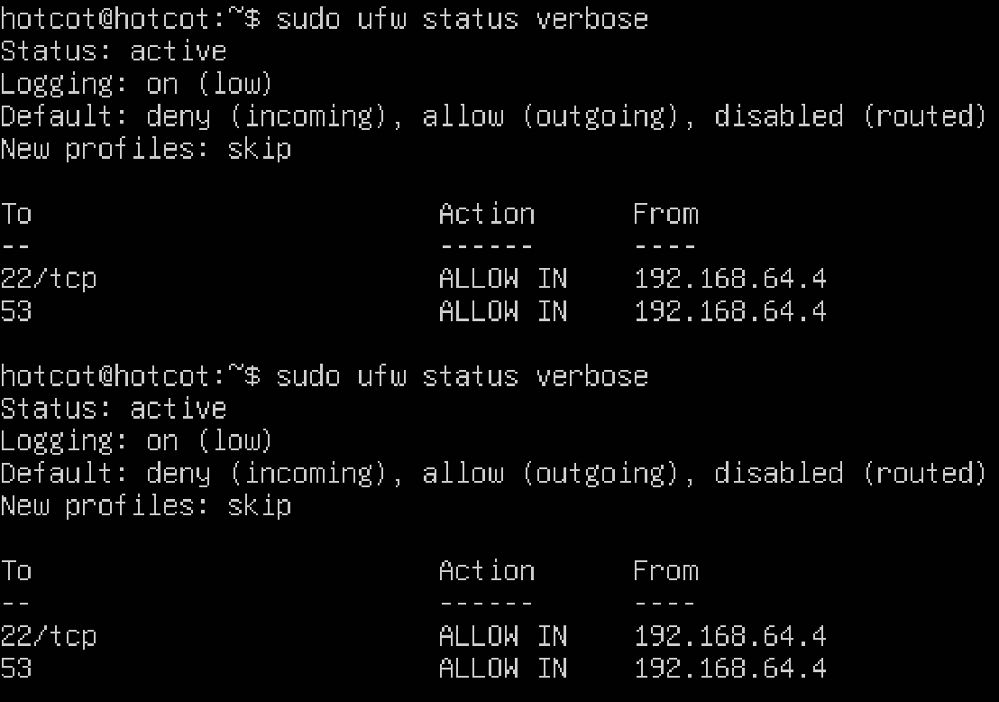
- Verified from VM2 that both allowed services still work after the firewall was enabled:
SSH
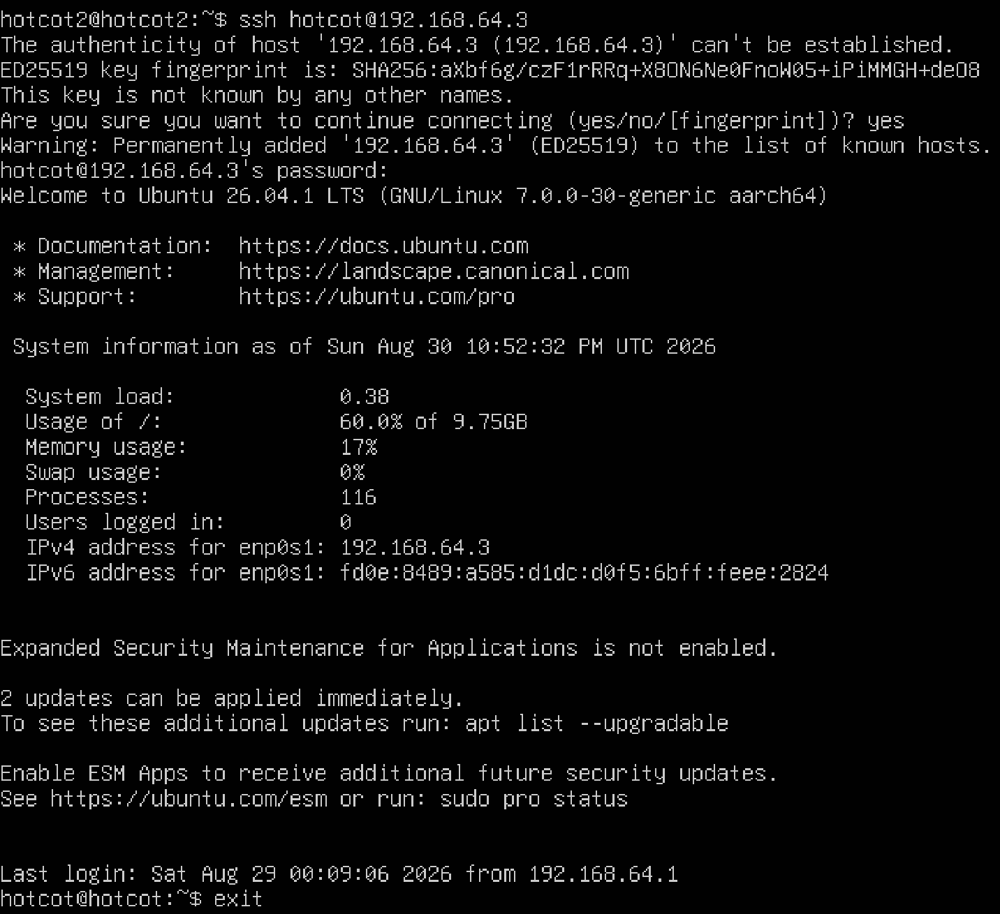
DNS
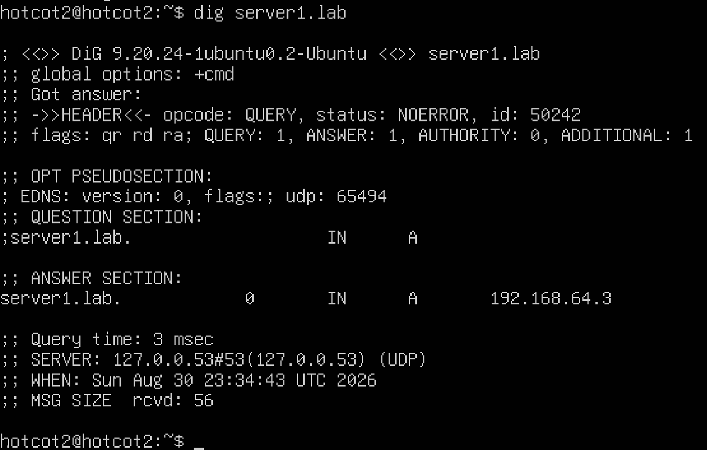
- Result: default-deny with two explicit allow rules, restricted to VM2's IP specifically rather than open to the whole subnet — this is the "before" baseline for tomorrow's deliberate break/fix.

**Next:** remove one rule intentionally, diagnose the failure using `ufw status` before assuming it's a DNS or network issue, then restore it.

**Sep 1, 2026 — Deliberate firewall misconfiguration and diagnosis**

**Break:**
- Removed the ufw rule allowing DNS from VM2:
```bash
  sudo ufw delete allow from 192.168.64.4 to any port 53
```

**Diagnosis (in order):**
1. Checked SSH access from VM2 — still worked fine, confirming the issue was 
   isolated to a specific service/rule, not a broader network or VM failure.
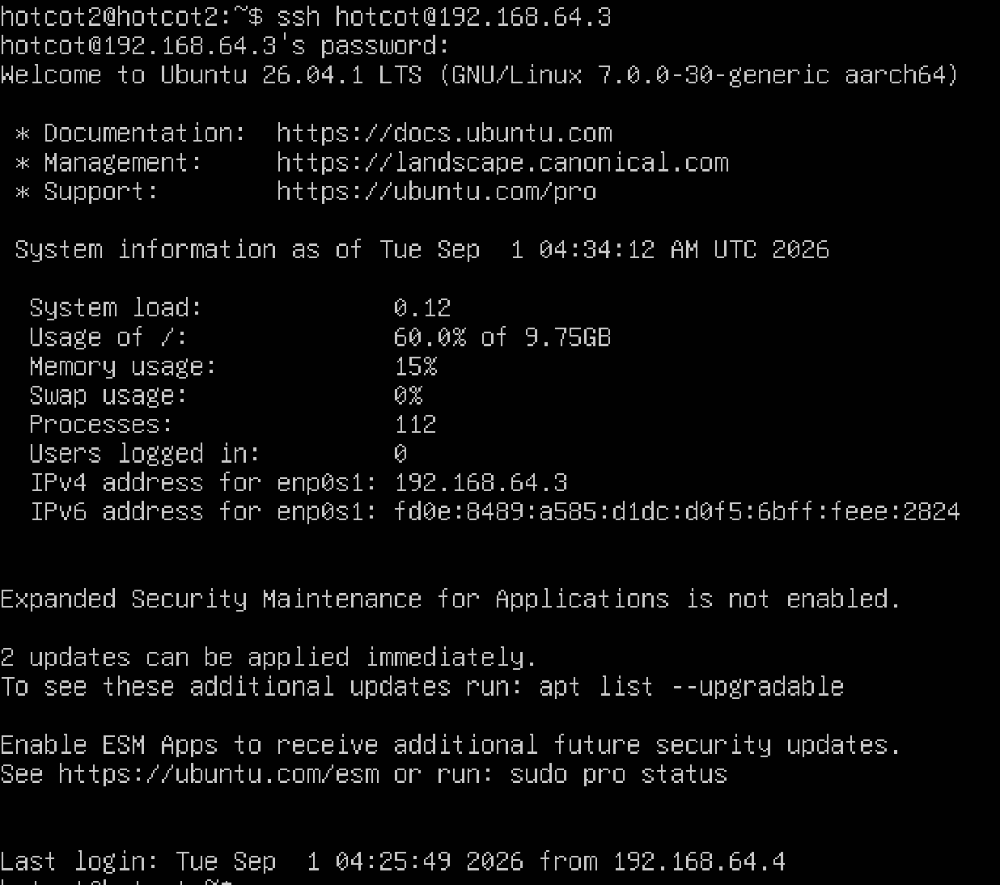
2. Checked DNS resolution from VM2 to confirm the actual symptom before 
   assuming a cause:
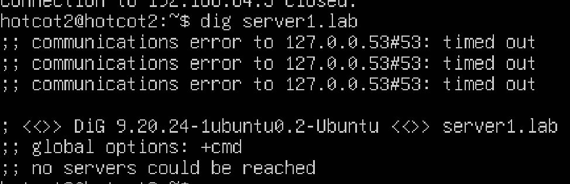
3. Checked dnsmasq status on VM1 to rule out a service-level failure:
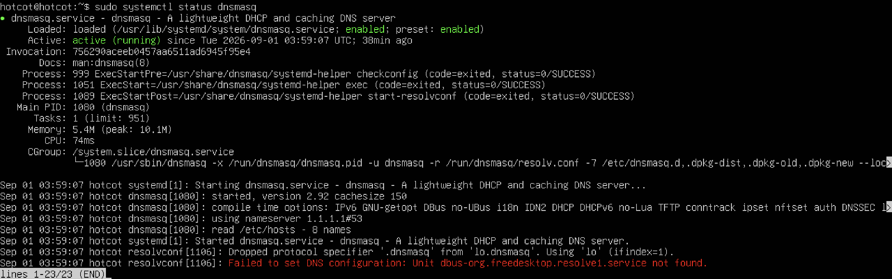
   Service was running, ruling out a dnsmasq problem and pointing toward 
   the firewall.
4. Checked ufw status directly and found the DNS rule missing:
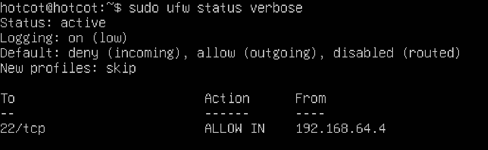

**Root cause:** the ufw rule allowing port 53 from VM2 had been removed, 
blocking DNS queries at the firewall while the dnsmasq service itself was 
healthy and SSH access remained unaffected — confirming the break was 
scoped to a single rule rather than a broader networking or service issue.

**Fix:**
```bash
sudo ufw allow from 192.168.64.4 to any port 53
```

**Verification:**
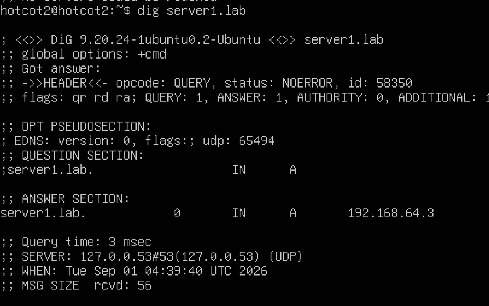

**Takeaway:** checking the unrelated service (SSH) first, then the target 
service's own health (dnsmasq), then the firewall config, ruled out two 
possible causes before finding the actual one — this order avoids wasting 
time changing the wrong thing first. Also confirmed: `ufw status verbose` 
is a fast, cheap first check whenever a specific service is unreachable 
but the host itself is otherwise fine.

**Week 2 complete.** Next: Week 3 — Entra ID users/groups, Conditional 
Access policy, and Intune device enrollment in the M365 tenant.

### Week 3 — Cloud Identity Basics (Entra ID / M365)

**Sep 1, 2026 — Users, group, and licensing**
- Created two test users in Entra ID (Identity → Users → New user):
  - Jan Kowalski
  - Sofia Chen
- Created a security group "Helpdesk-Test-Users" (Identity → Groups → New group) and added both users to it.
- Assigned a Business Premium license to Jan Kowalski via the M365 admin center (Users → Active users → Licenses and apps).
- Checked total license pool: 25 licenses included in the trial, 2 currently assigned.

**Verification:**

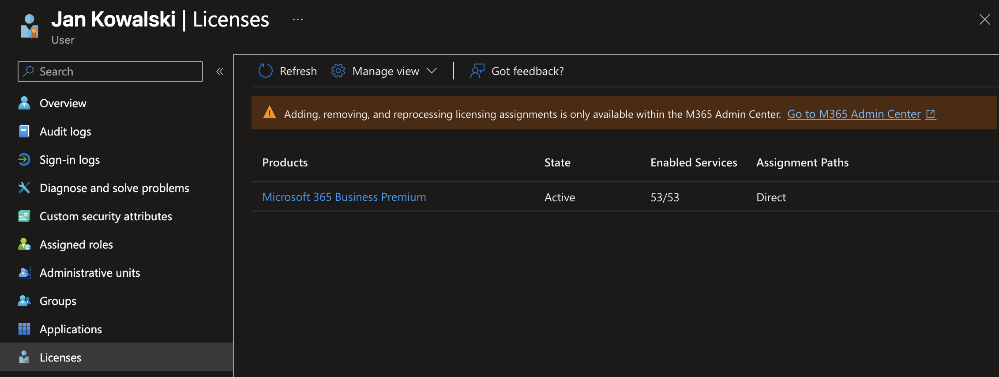


**Next:** set up a Conditional Access policy scoped to the Helpdesk-Test-Users 
group, in report-only mode first, with the admin account explicitly excluded 
as a safety measure before switching it live.

**Sep 2, 2026 — Conditional Access policy: MFA for Helpdesk-Test-Users**

**Setup:**
- Created policy `CA001-Helpdesk-RequireMFA-Baseline` (Protection → Conditional Access → New policy).
- Scope: Helpdesk-Test-Users group only (not All users).
- Exclusion: admin account explicitly excluded, as a second independent safety net beyond the group scoping.
- Grant control: Require multi-factor authentication.
- Initial state: Report-only mode.

**Test 1 — Report-only, Security Defaults still enabled:**
- Signed in as Jan Kowalski; MFA prompt appeared.
- Root cause: this was Security Defaults enforcing MFA tenant-wide, independent of the CA policy — report-only mode does not itself prompt for MFA, so this result didn't actually confirm the CA policy's logic yet.
- Disabled Security Defaults (Identity → Properties → Manage security defaults) to isolate the CA policy's behavior on its own.

**Test 2 — Report-only, Security Defaults disabled:**
- Signed in as Jan Kowalski again; no MFA prompt — expected, since report-only mode logs matches without enforcing them.
- Checked Conditional Access sign-in logs to confirm the policy showed as "would have applied" for this sign-in:

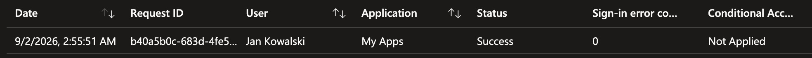

**Test 3 — Policy switched to On:**
- Enabled the policy live.
- Signed in as Jan Kowalski in a private browser window; MFA prompt appeared as expected.
- Confirmed admin account sign-in was unaffected (excluded as designed).

**Takeaway:** Security Defaults and custom Conditional Access policies can mask each other's behavior — disabling Security Defaults was necessary to test the CA policy in isolation. Also confirmed report-only mode is a logging-only step, not a soft-enforcement mode; the actual verification step is checking the sign-in logs for policy matches, not testing for a prompt that report-only was never going to produce.

**Next:** enroll a Windows 11 device in Intune to complete Week 3.